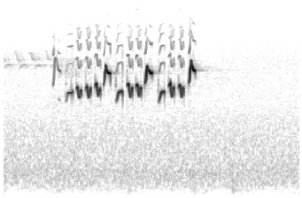

#### Classification of Bird Songs Using the Inception-v3 Network

## Introduction

While deep learning is widely applied to speech recognition, efforts to categorize environmental sounds or music with the same techniques are less common. To the best of my knowledge, the identification of bird songs from field recordings has only been attempted in [one paper](http://ceur-ws.org/Vol-1609/16090560.pdf) from 2016. The authors, Tóth and Czeba, used a standard short-time FFT procedure to convert audio into 2D spectrograms that are fed into a standard convolutional neural network (CNN). Interestingly, they also decided to drop the low-intensity portions of the images (i.e. set them to zero) to emphasize the actual features. This seemed slightly counterproductive to me, since the stark contrast between the zero-set portions and the leftovers produced artificial edges that a CNN would detect as features. Still, their results were solid: their best model, a variant of AlexNet, reached a MAP (mean average precision) of 43% over 999 classes.

For this project, I opted to build my own audio preprocessing pipeline and use the more complex [Inception-v3](https://arxiv.org/abs/1409.4842) model architecture.

## The Dataset

**Tufted Titmouse**

**White-Throated Sparrow**

**Tennessee Warbler (Male)**

The Cornell Lab of Ornithology provides a Master Set of bird field recordings, consisting of 2.65 GB (~5000 recordings) of bird songs and calls labeled by species and by type (e.g. "whistle call" or "song"). To narrow the focus of this project, I limited the dataset to just songs and included only bird species with at least 6 field recordings. This reduced the number of classes from 326 to 48.

Label        | Bird Species | Recordings
-------------|--------------|-------------
1|Tufted Titmouse|22
2|White-throated Sparrow|19
3|Tennessee Warbler|15
4|Magnolia Warbler|15
5|White-winged Crossbill|13
...|...|...
48|American Tree Sparrow|6

See the [labels file](/samples/labels.txt) for a full list of the 48 included birds.

## Data Preprocessing

To classify bird songs using a convolutional neural network (CNN) model, raw audio is sliced into short snippets then processed using a short-time Fourier transform (FFT) to produce a frequency-vs.-time spectrogram. This 2D greyscale "image" can then be fed into any standard CNN once properly scaled and cropped.

The FFT works as follows: a short-time window placed over the audio captures the frequency distribution of the sound at that instant in time. Sliding this window over the length of the data produces a 2D "image" that captures the frequency-vs.-time characteristics of the audio. Usually, a mel-scale (basically a log-scale) is used for the frequency axis.

For this project, I applied a Hamming window with an FFT size of 512 samples and overlap of 256 samples to produce 224x341 greyscale images representing 4 seconds of sound. The processing function in the TensorFlow graph takes a random 3.75-second crop (224x224) then rescales this to a shape (299x299) that matches the input of the Inception-v3 network. The random crop along the time axis is a data augmentation step; note that the frequency axis is not cropped in case absolute pitch proves useful for classification.

To balance the training dataset, images from less-populated classes are resampled multiple times per epoch to keep the model’s exposure to each class relatively even. Note that the images are slightly different each time they are sampled due to random cropping.

**Song of a Ruby-Crowned Kinglet**

## Model Architecture

Since I was limited by my personal GPU (GTX 960 with 4GB RAM), training a large CNN from scratch was not feasible. Instead, I initialized a pre-trained model then fine-tuned the learned weights on my dataset, a technique called transfer learning. I used the Inception-v3 CNN model architecture, as specified in [the paper](https://arxiv.org/abs/1409.4842) and provided by the TensorFlow Slim model library. Inception-v3 achieved 000000 accuracy on the [ImageNet](http://www.image-net.org/) training set of 000000 images from 000000 classes.

The Inception architecture is based on the "Inception module", a parallel stack of convolutional filters (1x1, 3x3, 5x5) alongside a pooling layer. Because large convolutions (3x3, 5x5) are computationally expensive when applied to a layer with a large number of filters, 1x1 convolutions (convolutions over the depth dimension) are placed before these larger convolutions to reduce the dimensionality of the input. This was first done in 2014 for the original 22-layer Inception network, [GoogLeNet](https://arxiv.org/abs/1409.4842).

For Inception-v3 (2016), Google improved the modules further by factorizing large convolutions: replacing 5x5 convolutions with two 3v3 convolutions, replacing 7x7 convolutions with 1x7 and 7x1 convolutions in series, etc. The final net, which contained these changes and numerous other improvements, was 42 layers deep but with a computational cost only 2.5 times higher than GoogLeNet; see [the paper](https://arxiv.org/abs/1512.00567) for a detailed description of the model architecture.

Although Inception-v3 was trained on an image classification task, I expected the model to transfer fairly well to audio classification. The visual features in bird song spectrograms (e.g. patterned lines and squiggles) are easily distinguishable by a human observer, so they should also be picked up by the early layers of CNNs, which are generally responsible for detecting low-level visual features.

I initially froze these lower layers with the ImageNet-trained weights and trained only the final fully-connected layer used for classification. Then, I "fine-tuned" the model by unfreezing the rest of the layers and training the entire network over many epochs.

## Training Final Fully-Connected Layer

After training the final layer for 200 epochs, the model achieved 27.7% accuracy on the train set and 24.0% on the validation set.

-------------|--------------
Loss|4.541
Train Accuracy|27.7%
Validation Accuracy|24.0%

For this training run, the Adam optimizer was set to an initial learning rate of 000000. Good values of learning rate and epsilon were determined by a random search, as illustrated below, yielding `learning_rate=6.1e-3` and `epsilon=0.93`.

## Results - Training Full Net

Continuing from the above partially-trained model, I trained the full net (all trainable weights) for 750 more epochs. Again, I did a hyperparameter search and settled on `learning_rate=7.8e-4` and `epsilon=0.67`.

-------------|--------------
Loss|3.213
Train Accuracy|46.4%
Validation Accuracy|41.7%

The loss and accuracy appear to have plateaued within the first 200 epochs. While it may be possible to squeeze more performance out of this network with different settings, it's also possible that the dataset is too small or too inherently noisy or random to improve much further. I still need to test some image processing settings (e.g. sample length) and hyperparameters (weight decay, learning rate, etc.) to be confident I can't do better.

These are my final results using the held-out test set (286 images over 48 classes):

-------------|--------------
Test Accuracy|27.3%
Top-5 Accuracy|59.3%

## Examples of Correct Predictions

Let's take a look at some of the model's predictions. For each prediction, I've also included a random sample from the true class and a random sample from the class predicted by the model, which might give us an idea of what is happening when the model makes a mistake.

### Example 1 - [\#48 - American Tree Sparrow]

[Audio - Left Image](/samples/wav/48_4.wav)

[Audio - Right Image](/samples/wav/48_5.wav)

### Example 2 - [\#44 - Blue Grosbeak]

[Audio - Left Image](/samples/wav/44_4.wav)

[Audio - Right Image](/samples/wav/44_1.wav)

### Example 3 - [\#17 - Virginia's Warbler]

[Audio - Left Image](/samples/wav/17_2.wav)

[Audio - Right Image](/samples/wav/17_1.wav)

### Example 4 - [\#34 - Orange-Crowned Warbler (Lutescens)]

[Audio - Left Image](/samples/wav/33_5.wav)

[Audio - Right Image](/samples/wav/33_0.wav)

## Examples of Incorrect Predictions

### Example 5 - [\#34 - Orange-Crowned Warbler (Lutescens)]

[Audio - Left Image](/samples/wav/34_2.wav)

[Audio - Right Image](/samples/wav/24_1.wav)

### Example 6 - [\#13 - Lincoln's Sparrow]

[Audio - Left Image](/samples/wav/13_8.wav)

[Audio - Right Image](/samples/wav/6_5.wav)

### Example 7 - [\#32 - Purple Finch (Eastern)]

[Audio - Left Image](/samples/wav/32_4.wav)

[Audio - Right Image](/samples/wav/23_1.wav)

## Conclusions

By finetuning the Inception-v3 network on a birdsong classification problem, I was able to achieve 27.3% top-1 and 59.3% top-5 accuracy across 48 classes. Further experiments will be necessary to determine whether I can wring more performance out of this model by improving the  image processing pipeline or by optimizing hyperparameters (weight decay, choice of optimizer, etc.). Of course, it's also possible that the dataset is too small (1800 distinct training images) or too inherently noisy/random (the same bird song can vary from sample to sample) to improve much further.

What can we do with bird songs and other interesting sounds besides classification? At one point I wanted to try my hand at musical style transfer ala [neural-style](https://github.com/jcjohnson/fast-neural-style) or generate a sonic "visualization" of intermediate model layers as is done with image-based nets. Sadly, there is a catch associated with the spectrogram approach: the spectrogram image is only the real part of the Fourier transform. The phase information, i.e. the imaginary part of the FFT, is "lost", or at least not directly moldable by the network.

In other words, if we try to use a deep neural network to produce original sounds, audio reconstruction based on the model-generated spectrograms will be lossy without the phase information. Direct audio style-transfer (e.g. "genre swaps" for music) might therefore require training on raw (1D) audio rather than 2D spectrograms, which would necessitate a different model architecture. One attempt in the literature to apply a time-convolutional neural network to raw audio was unable to outperform a spectrogram-based approach (see ["End-to-end learning for music audio"](http://benanne.github.io/research/)).

I confess that I am not an expert on the theory behind FFTs and phase reconstruction - if you are aware of a better solution, please let me know!
