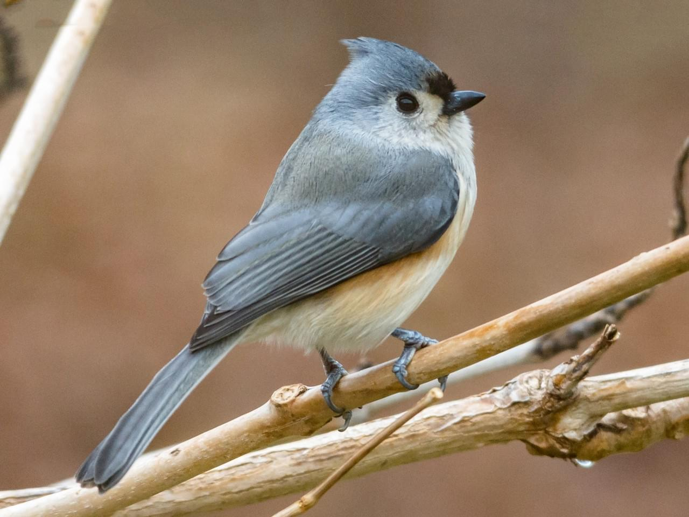
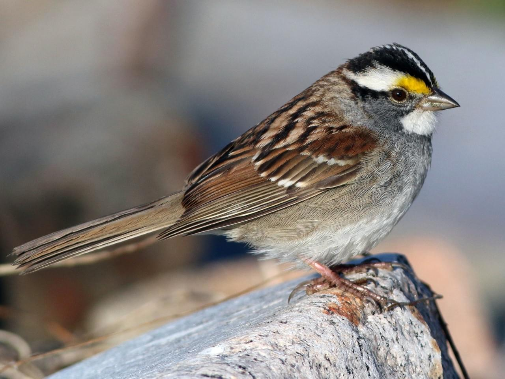
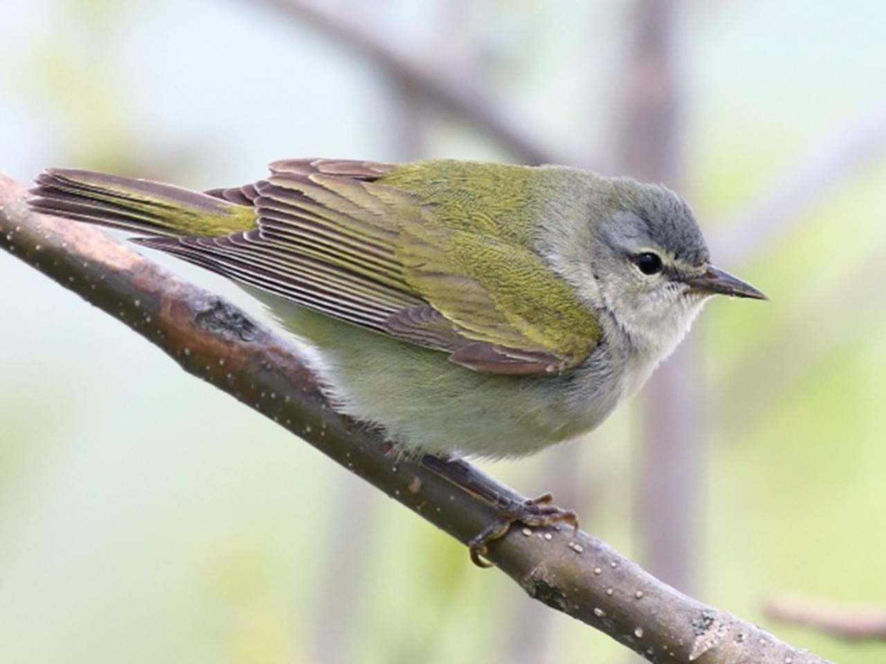

# Introduction


# Approaches to Spectrogram Classification


Test.[^fn1]

Traditionally, music informatics research (MIR) has used human-constructed features such as mel-frequency cepstral coefficients (MFCCs) and chromas to categorize and analyze audio. Even some approaches based on deep learning have used temporal chroma and timbral coefficients rather than raw audio as inputs to neural networks.[ref] More recently, researchers have attempted end-to-end classification using both raw audio and spectrograms; in one result, using spectrograms as input to a CNN outperformed a raw-audio CNN.[ref]


The typical approach to


To the best of my knowledge, the only work to date that used CNNs to classify bird-song spectrograms is a [2016 paper](http://ceur-ws.org/Vol-1609/16090560.pdf).[^fn1] The authors converted audio from the [Xeno-Canto database](http://www.xeno-canto.org/) to spectrograms using the standard short-time FFT procedure (Hamming window, frame length of 512 samples, and 256-sample overlap). Interestingly, the authors decided to "drop" (i.e. set to zero) low-intensity portions of the images, which to me seems counterproductive - the stark contrast between the zero-set portions and the leftover patterns produced artificial sharp edges that a CNN would detect as edges. In any case, their best model, a variant of AlexNet, reached a MAP (mean average precision) of 43% over 999 classes. While some aspects of their work were encouraging, I opted to build a different audio preprocessing pipeline and utilize a more complex model architecture (Inception-v3) for classification, as described below.


# The Dataset




2.65 GB of bird sound recordings (.mp3 format)

The Master Set includes ~5000 recordings of bird songs and calls, labeled by species and by type (e.g. "whistle call" or "song"). To narrow the focus of my efforts to distinguishing bird species, I included only bird songs from the top 48 species, as ordered by number of recordings available.

23 recordings --> min 6 recordings (48 species)

Label        | Bird Species
-------------|--------------
1|Tufted Titmouse
2|White-throated Sparrow
3|Tennessee Warbler
4|Magnolia Warbler
5|White-winged Crossbill
6|Ruby-crowned Kinglet
7|Connecticut Warbler
8|Cape May Warbler
9|Blackburnian Warbler
10|Bay-breasted Warbler
11|Olive Warbler
12|Northern Cardinal
13|Lincoln's Sparrow
14|Golden-crowned Sparrow
15|Yellow Warbler
16|White-eyed Vireo
17|Virginia's Warbler
18|Townsend's Warbler
19|Lucy's Warbler
20|Black-crested Titmouse
21|American Redstart
22|Song Sparrow
23|Red-faced Warbler
24|Pine Warbler
25|Northern Mockingbird
26|Chipping Sparrow
27|Brown Creeper (Eastern)
28|Black-throated Blue Warbler
29|Yellow-eyed Junco
30|White-breasted Nuthatch (Interior West)
31|Swainson's Thrush (Olive-backed)
32|Purple Finch (Eastern)
33|Ovenbird
34|Orange-crowned Warbler (lutescens)
35|Mourning Warbler
36|Lapland Longspur
37|Kirtland's Warbler
38|House Wren
39|Golden-winged Warbler
40|Eastern Towhee
41|Chestnut-sided Warbler
42|Carolina Chickadee
43|Blue-winged Warbler
44|Blue Grosbeak
45|Black-and-white Warbler
46|Bewick's Wren (Interior West)
47|Baltimore Oriole
48|American Tree Sparrow


# Data Preprocessing

To classify bird-song audio using a convolutional neural network (CNN) model, the audio must be sliced into short snippets then processed using a Fourier transform (FFT) to generate a frequency-vs.-time spectrogram, which can then be fed into any standard CNN once properly scaled into a square greyscale image.

The FFT works as follows: a short-time window placed over the audio captures the frequency distribution of the sound at that instant in time. Sliding this window over the length of the data produces a 2D "image" that captures the frequency-vs.-time characteristics of the audio. For this project, I used a Hamming window with an FFT size of 512 samples and window-overlap of 256 samples to produce 224x341 greyscale images (0 to 44100 Hz, 4 seconds wide). Later in the pipeline, a random crop is taken (224x224) then rescaled to an input shape (299x299) matching the base layer of the Inception-v3 network. The random crop in the time dimension served as data augmentation; note that the frequency dimension was not cropped in case absolute pitch proved useful for distinguishing songs.


# Model Architecture


Since I was limited by my personal GPU (GTX 960 with 6GB RAM), training a large model from scratch was not feasible. Instead, I started from a pre-trained model then fine-tuned the learned weights using my data, a technique called transfer learning. I used the Inception-v3 (GoogLeNet) CNN model architecture, as specified in [this paper](http://www.image-net.org/) and provided by the TensorFlow Slim model library.

*Add model architecture information.*


Although this network was trained on a standard image classification task (000000 error (accuracy) on the [ImageNet](http://www.image-net.org/) training set of 000000 images from 000000 classes), I expected the model to transfer reasonably well to an audio classification task. The bird-song spectrograms have features (e.g. patterned lines and squiggles) that are visually distinguishable by a human observer and likely to be detected by the lower layers in a CNN, which are responsible for detecting these low-level features. My approach was to first freeze these lower layers with the ImageNet-trained weights and train only the final fully-connected layer (fc8), then "fine-tune" by unfreezing the rest of the net and training all weights over many epochs.


# Results - Finetuning Final Layer (fc8)


# Results - Finetuning All Layers


# Conclusions

While deep neural networks applied to spectrograms can succeed in classifying audio, the spectrogram approach cannot be used to generate or modify audio. Why? Because the spectrogram is only the real part of the FFT - the imaginary part (the phase information) is lost. Any attempt to reconstruct audio from a newly generated spectrogram is necessarily lossy without the phase information. For this reason, fun tricks like visual style-transfer ala Johnson (0000) aren't compatible with this spectrogram-based approach. Direct audio style-transfer (e.g. "genre swaps" for music) would instead require training a deep neural network on raw 1D audio data, which of course would require a new model architecture.

*Past work on deep learning using raw audio*


# References

[^fn1] Tóth, B.P. and Czeba, B., 2016, September. Convolutional Neural Networks for Large-Scale Bird Song Classification in Noisy Environment. In CLEF (Working Notes) (pp. 560-568).

---

---
__Advertisement :)__

- __[pica](https://nodeca.github.io/pica/demo/)__ - high quality and fast image
  resize in browser.
- __[babelfish](https://github.com/nodeca/babelfish/)__ - developer friendly
  i18n with plurals support and easy syntax.

You will like those projects!

---

# h1 Heading 8-)
## h2 Heading
### h3 Heading
#### h4 Heading
##### h5 Heading
###### h6 Heading


## Horizontal Rules

___

---

***


## Typographic replacements

Enable typographer option to see result.

(c) (C) (r) (R) (tm) (TM) (p) (P) +-

test.. test... test..... test?..... test!....

!!!!!! ???? ,,  -- ---

"Smartypants, double quotes" and 'single quotes'


## Emphasis

**This is bold text**

__This is bold text__

*This is italic text*

_This is italic text_

~~Strikethrough~~


## Blockquotes


> Blockquotes can also be nested...
>> ...by using additional greater-than signs right next to each other...
> > > ...or with spaces between arrows.


## Lists

Unordered

+ Create a list by starting a line with `+`, `-`, or `*`
+ Sub-lists are made by indenting 2 spaces:
  - Marker character change forces new list start:
    * Ac tristique libero volutpat at
    + Facilisis in pretium nisl aliquet
    - Nulla volutpat aliquam velit
+ Very easy!

Ordered

1. Lorem ipsum dolor sit amet
2. Consectetur adipiscing elit
3. Integer molestie lorem at massa


1. You can use sequential numbers...
1. ...or keep all the numbers as `1.`

Start numbering with offset:

57. foo
1. bar


## Code

Inline `code`

Indented code

    // Some comments
    line 1 of code
    line 2 of code
    line 3 of code


Block code "fences"

```
Sample text here...
```

Syntax highlighting

``` js
var foo = function (bar) {
  return bar++;
};

console.log(foo(5));
```

## Tables

| Option | Description |
| ------ | ----------- |
| data   | path to data files to supply the data that will be passed into templates. |
| engine | engine to be used for processing templates. Handlebars is the default. |
| ext    | extension to be used for dest files. |

Right aligned columns

| Option | Description |
| ------:| -----------:|
| data   | path to data files to supply the data that will be passed into templates. |
| engine | engine to be used for processing templates. Handlebars is the default. |
| ext    | extension to be used for dest files. |


## Links

[link text](http://dev.nodeca.com)

[link with title](http://nodeca.github.io/pica/demo/ "title text!")

Autoconverted link https://github.com/nodeca/pica (enable linkify to see)


## Images


Like links, Images also have a footnote style syntax

![Alt text][id]

With a reference later in the document defining the URL location:

[id]: https://octodex.github.com/images/dojocat.jpg  "The Dojocat"


## Plugins

The killer feature of `markdown-it` is very effective support of
[syntax plugins](https://www.npmjs.org/browse/keyword/markdown-it-plugin).


### [Emojies](https://github.com/markdown-it/markdown-it-emoji)

> Classic markup: :wink: :crush: :cry: :tear: :laughing: :yum:
>
> Shortcuts (emoticons): :-) :-( 8-) ;)

see [how to change output](https://github.com/markdown-it/markdown-it-emoji#change-output) with twemoji.


### [Subscript](https://github.com/markdown-it/markdown-it-sub) / [Superscript](https://github.com/markdown-it/markdown-it-sup)

- 19^th^
- H~2~O


### [\<ins>](https://github.com/markdown-it/markdown-it-ins)

++Inserted text++


### [\<mark>](https://github.com/markdown-it/markdown-it-mark)

==Marked text==


### [Footnotes](https://github.com/markdown-it/markdown-it-footnote)

Footnote 1 link[^first].

Footnote 2 link[^second].

Inline footnote^[Text of inline footnote] definition.

Duplicated footnote reference[^second].

[^first]: Footnote **can have markup**

    and multiple paragraphs.

[^second]: Footnote text.


### [Definition lists](https://github.com/markdown-it/markdown-it-deflist)

Term 1

:   Definition 1
with lazy continuation.

Term 2 with *inline markup*

:   Definition 2

        { some code, part of Definition 2 }

    Third paragraph of definition 2.

_Compact style:_

Term 1
  ~ Definition 1

Term 2
  ~ Definition 2a
  ~ Definition 2b


### [Abbreviations](https://github.com/markdown-it/markdown-it-abbr)

This is HTML abbreviation example.

It converts "HTML", but keep intact partial entries like "xxxHTMLyyy" and so on.

*[HTML]: Hyper Text Markup Language

### [Custom containers](https://github.com/markdown-it/markdown-it-container)

::: warning
*here be dragons*
:::
